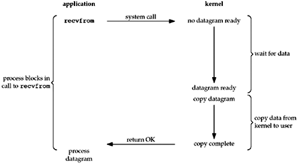

## redis 知识点梳理

##### 常用的5种数据类型

- `string`
-  `hash`
-  `list`
-  `set` 
- `sorted set`

##### 命名空间

- 键值对中的键命名以冒号分开即可

##### 过期策略和内存淘汰机制

定期删除 + 惰性删除

- 定期删除

  >比如,每个100ms ,随机抽取进行检查

- 惰性删除

  > 获取某个key 时,会检查是否过期

**内存淘汰机制**

- 写入报错

- 随机删除

- 移除最少使用的 key

  > 目前在用

- 移除过期最少使用的 key

- 随机移除过期的 key

- 移除最早过期的 key

##### 缓存雪崩

>定义: 指在某一个时间段，缓存集中过期失效
>
>方案: 

##### 缓存穿透

>定义: 查询一个数据库一定不存在的数据
>
>方案: 缓存空值

##### 缓存击穿

>定义: 指一个key非常热点，在不停的扛着大并发，大并发集中对这一个点进行访问，当这个key在失效的瞬间，持续的大并发就穿破缓存，直接请求数据库，就像在一个屏障上凿开了一个洞。
>
>方案:  不要设缓存过期时间, 通过存储时间字段来记录过期时间,并作更新缓存操作。

#### 数据分区

- 算法

  > hash 算法 
  >
  > 一致性hash 算法
  >
  > 一致性hash + 虚拟节点
  >
  > hash slot 算法

#### 阻塞I/O、非阻塞I/O

参考资料：

[阻塞I/O、非阻塞I/O和I/O多路复用](https://www.cnblogs.com/skiler/p/6852493.html)

[io 多路复用技术](<https://www.zhihu.com/question/28594409>)

[io 多路复用技术详解](<https://blog.csdn.net/sehanlingfeng/article/details/78920423>)

[图解阻塞I/O、非阻塞I/O](<https://blog.csdn.net/CharJay_Lin/article/details/84476753>)

[io 模式](<https://blog.csdn.net/qq_34802511/article/details/81543817>)

##### 用户空间和内核空间

- 虚拟寻址：处理器产生一个虚拟地址，然后翻译成物理地址，再通过总线的传递，最后处理器拿到物理地址返回的字节
- 虚拟空间分为：内核空间和用户空间

##### I/O模式

对于**一次IO访问（这回以read举例）**，数据会先被拷贝到操作系统内核的缓冲区中，然后才会从操作系统内核的缓冲区拷贝到应用程序的缓冲区，最后交给进程。

##### 同步和异步

- 用户线程和内核的交互方式。同步：用户发起IO请求时需要等待或者轮询内核IO操作完成后才能继续执行。异步：用户发起IO请求后继续执行，当内核IO操作完成后通知用户线程，或者调用用户线程的回调函数。

##### 阻塞和非阻塞

- 用户线程调用内核IO操作的方式。阻塞：IO操作完成后返回到用户线程。非阻塞：IO操作被调用后，立即返回一个状态值，无需等待IO操作完成。

##### 阻塞I/O (blocking io)

##### 非阻塞I/O

##### io 多路复用

- IO多路复用使用两个系统调用(select/poll/epoll和recvfrom)，blocking IO只调用了recvfrom；
- 连接数不高的话，性能不一定比多线程+阻塞IO好
- 采用回调而不是轮询，没有文件描述符限制

#### 二进制安全

[二进制安全](<https://www.cnblogs.com/storebook/p/12689175.html>)

- 在传输数据时,保证二进制数据的信息安全,也就是不被篡改,破译等,如果被攻击,能够及时检测出来
- C字符串:只能保存文本数据,而不能保存像图片、音频、视频、压缩文件这样的二进制数据。
- 以二进制的方式处理数据
- 使用len属性的值而不是空字符串来判断字符串是否结束

#### 文本文件和二进制文件

[网络传输-文本文件和二进制文件的区别](<https://www.cnblogs.com/kangqi452/p/11675285.html>)

- 文本文件是基于字符编码的文件
- 二进制文件是基于值编码的文件
- 二进制文件是把内存中的数据按其在内存中的存储形式原样输出到磁盘中存放
- 文本文件是把数据的终端形式的二进制数据输出到磁盘上存放,即存放数据的终端形式

#### base64

- 是一种用64个字符来表示任意二进制数据的方法

#### 算法复杂度

[算法复杂度的含义](<https://blog.csdn.net/A_dg_Jffery/article/details/99713579>)

- 对应算法的事件复杂度,也表示空间复杂度
- 时间和空间都是计算机资源的重要体现
- O(1) 常数阶: hash 算法 (耗时与输入数据无关)
- O(logn) 对数阶: 二分法
- O(n) 线性阶: 遍历算法
- O(n^2) 平方阶: 冒泡算法

